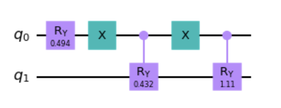
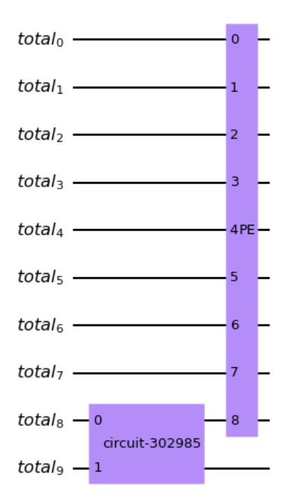
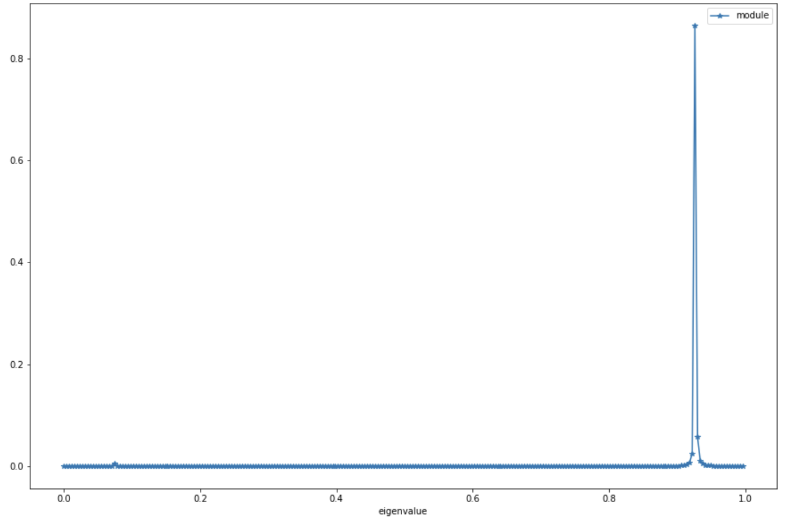

Example
============

+++++++++++++++
Basic usage
+++++++++++++++

First, you have to import the necessary modules from the package. Then, you can generate a random Hermitian 
matrix using the :meth:`~QPCA.preprocessingUtilities.generate_matrix` method provided in the package. You can 
set the matrix dimension and a seed for the reproducibility of the execution.

..  code-block:: python

    /**
     * 
     */
      from QPCA.decomposition.Qpca import QPCA
      import numpy as np
      import matplotlib.pyplot as plt
      import random
      import pandas as pd
      from QPCA.preprocessingUtilities.preprocessing import generate_matrix

      matrix_dimension=2
      seed=19
      input_matrix=generate_matrix(matrix_dimension=matrix_dimension,seed=seed)

..  code-block:: python

   >>> print(input_matrix)
   
   [[0.59 0.13]
   [0.13 0.08]]

   eigenvalue: 0.04912229458049476 - eigenvector: [-0.233  0.973]
   eigenvalue: 0.6199503657038241 - eigenvector: [0.973 0.233]

Once you have your input matrix, you can fit your QPCA model by specifying the number of resolution qubits 
that you need for the phase estimation process. Remember that a higher resolution generally results in better accuracy but lower performance.
Additionally, please note that the input matrix will be normalized by its trace, which may cause the eigenvalues to change.

..  code-block:: python

      resolution=8
      qpca=QPCA().fit(input_matrix,resolution=resolution,plot_qram=True,plot_pe_circuit=True)
      
..  code-block:: python

   >>> print(np.linalg.eig(qpca.input_matrix))
  
   (array([0.92658152, 0.07341848]),
   array([[ 0.9725247 , -0.23279972],
          [ 0.23279972,  0.9725247 ]]))

If you set the boolean flag plot_qram and plot_pe_circuit to True, as in the example before, you will be able to see two plots similar to the ones shown below.

This plot specifically represents the circuit that implements the encoding of the input matrix in the quantum registers. By default, an optimized version of the encoding circuit is implemented using the
StatePreparation class of Qiskit.

.. image:: Images/optimized_qram.png

If you specify :obj:`~QPCA.decomposition.QPCA.optimized_qram` as False in the :meth:`~QPCA.decomposition.QPCA.fit` method, a custom version 
of the encoding circuit will be implemented.
As you can see, the number of qubits required to store the matrix is in the order of log(n*m), where n and m 
are the number of rows and columns of the input matrix.

The other plot represents the general circuit, which includes both the encoding part and the phase estimation operator. 
Please note that the number of qubits used for the phase estimation in this case is 9: 8 specified by the resolution parameter to encode the eigenvalues and 1 to encode the eigenvectors.
In general, the number of qubits will be equal to the resolution parameter plus half of the qubits used for matrix encoding.

The core part of this library is the eigenvector reconstruction, which can be performed using the :meth:`~QPCA.decomposition.QPCA.eigenvectors_reconstruction` function.
As input parameters, you can specify :obj:`~QPCA.decomposition.QPCA.n_shots`, which is the number of measurements to be performed in the state vector tomography, :obj:`~QPCA.decomposition.QPCA.n_repetitions`, which is the number of times the tomography process should be repeated,
and :obj:`~QPCA.decomposition.QPCA.plot_peaks`, if you want to plot the output of the phase estimation, representing the most valuable approximated eigenvalues.
 
..  code-block:: python

      eig=qpca.eigenvectors_reconstruction(n_shots=1000000,n_repetitions=1,plot_peaks=True)

..  code-block:: python

   >>> print(eig)
   
   array([0.92578125, 0.07421875]),
   array([[ 0.97257301, -0.22836194],
        [ 0.23277106,  0.97266614]])

By setting the boolean flag :obj:`~QPCA.decomposition.QPCA.plot_peaks` to True, , you can visualize a plot similar to the one below.
The plot displays peaks that represent the eigenvalues approximated with high probability by the phase estimation. 
In this example, the two peaks are 0.92 and 0.07, which correspond to the two estimated eigenvalues based on the provided resolution and number of shots.

Finally, you can reconstruct the original input matrix using the :meth:`~QPCA.decomposition.QPCA.quantum_input_matrix_reconstruction`. 

..  code-block:: python

      rec_input_matrix=qpca.quantum_input_matrix_reconstruction()

..  code-block:: python

   >>> print(rec_input_matrix)
   
   array([[0.5884931 , 0.12919742],
         [0.12919742, 0.08054153]])

+++++++++++++++
Threshold optimization 
+++++++++++++++

In the :meth:`~QPCA.decomposition.QPCA.quantum_input_matrix_reconstruction` method, you can specify the :obj:`~QPCA.decomposition.QPCA.eigenvalue_threshold` parameter to discard the estimated eigenvalues that are smaller than the specified value.

..  code-block:: python

      eig=qpca.eigenvectors_reconstruction(n_shots=1000000, n_repetitions=1, plot_peaks=True, eigenvalue_threshold=0.1)

As shown below, by setting a threshold of 0.1, you remove the last eigenvalue and retain only the largest one.

..  code-block:: python

   >>> print(eig)

   array([0.92578125]),
   array([[0.9725207],
        [0.2333083]])

.. image:: Images/threshold.png

This type of threshold can be useful for excluding the smallest eigenvalues, which are often the most challenging to estimate accurately. 
Additionally, the associated eigenvectors of these small eigenvalues tend to have higher reconstruction errors. 
By applying a threshold to remove these eigenvalues, you can potentially improve the overall quality of the eigenvector reconstruction.

+++++++++++++++
Absolute tolerance 
+++++++++++++++

The absolute tolerance serves as a threshold to discard noisy eigenvalues and their corresponding eigenvectors that may arise when the number of resolution qubits and/or the number of measurements performed in the tomography is insufficient.

Let's consider the following example to illustrate the issue. 
To better visualize the problem, a 4x4 matrix is used, with a resolution of 6 qubits and 1.000.000 shots performed for eigenvector reconstruction.
..  code-block:: python

      resolution=6
      matrix_dimension=4
      input_matrix=generate_matrix(matrix_dimension=matrix_dimension,seed=seed)

..  code-block:: python

   >>> print(input_matrix)
   
      [[0.63 0.55 0.5  0.89]
      [0.55 1.41 1.1  1.3 ]
      [0.5  1.1  1.08 1.47]
      [0.89 1.3  1.47 2.36]]

      eigenvalue: 0.01593042549125613 - eigenvector: [ 0.23  -0.357  0.812 -0.4  ]
      eigenvalue: 0.2943707848528235 - eigenvector: [ 0.882  0.207 -0.303 -0.295]
      eigenvalue: 0.5238941243476808 - eigenvector: [-0.304  0.772  0.163 -0.534]
      eigenvalue: 4.647071393343875 - eigenvector: [-0.277 -0.483 -0.471 -0.685]

..  code-block:: python

      qpca=QPCA().fit(input_matrix,resolution=resolution,plot_qram=True,plot_pe_circuit=True)

..  code-block:: python

   >>> print(np.linalg.eig(qpca.input_matrix))
  
   (array([0.84780975, 0.09557902, 0.05370488, 0.00290634]),
   array([[-0.27669967, -0.30381059,  0.88229208,  0.2295585 ],
         [-0.48274483,  0.77216236,  0.20746302, -0.35732594],
         [-0.47083591,  0.16297368, -0.30291613,  0.81240073],
         [-0.68462272, -0.53376399, -0.29455322, -0.39953239]]))

..  code-block:: python

      eig=qpca.eigenvectors_reconstruction(n_shots=1000000,n_repetitions=1,plot_peaks=True)

As shown below, there is an eigenvalue (e.g., 0.265625 in this case) that does not match any of the original eigenvalues. This discrepancy is evident from the peaks plot, which does not exhibit a peak around 0.26. 
Therefore, this eigenvalue can be attributed to fluctuations or noise introduced during the classical postprocessing phase, as the classical eigenvalue extraction algorithm typically searches for a maximum of 4 eigenvalues (corresponding to the initial matrix dimension of 4).

However, it is worth noting that the QPCA algorithm, with the specified configuration, successfully identified 3 peaks or "correct" eigenvalues. 
The fourth eigenvalue, which corresponds to the smallest original eigenvalue, is an artifact introduced by the postprocessing stage.

..  code-block:: python

   >>> print(eig)
   
   array([0.84375 , 0.09375 , 0.046875, 0.265625]),
   array([[ 0.27680417, -0.27660952,  0.80547637,  0.29495506],
        [ 0.48230629,  0.67785086,  0.10991118,  0.48594109],
        [ 0.4694504 ,  0.13039498, -0.38167556,  0.41712944],
        [ 0.68528434, -0.52157991, -0.38353287,  0.69620819]])

.. image:: Images/absolute_tolerance1.png

To address this issue, you have two options: increase the number of resolution qubits and/or the number of shots. 
However, if these numbers are already sufficiently large and cannot be further increased due to performance constraints, you can utilize the :obj:`~QPCA.decomposition.QPCA.abs_tolerance` parameter to specify a specific tolerance level.

As demonstrated, by setting this parameter to 0.001, you can eliminate the noisy eigenvalue and obtain accurate estimates for all the correct eigenvalues and their corresponding eigenvectors. 
If you also wish to accurately estimate the smallest eigenvalue, it is likely necessary to increase the number of resolution qubits.

..  code-block:: python

      eig=qpca.eigenvectors_reconstruction(n_shots=1000000,n_repetitions=1,plot_peaks=True,abs_tolerance=1e-03)

..  code-block:: python

   >>> print(eig)
   
   array([0.84375 , 0.09375 , 0.046875]),
   array([[ 0.27703224, -0.26507805,  0.81246826],
        [ 0.48292227,  0.68519289,  0.11092602],
        [ 0.46941485,  0.12992164,  0.36394397],
        [ 0.68487267, -0.5051309 ,  0.37952075]])

The extraction of peaks is based on evaluating the average vertical distance of each peak from its neighboring peaks. 
Therefore, when specifying an absolute tolerance, you are essentially determining the average vertical height below which a peak is considered as noise or a fluctuation rather than a valid peak.
The default value for the absolute tolerance is set to 1/n_shots, as it is loosely related to the average vertical distance between neighboring peaks, which, in turn, can be influenced by the number of shots performed in the tomography. 
However, due to statistical variance in measurements, this relationship may not always hold true. Hence, if you encounter an unexpected eigenvalue, it is advisable to increase the tolerance by an order of magnitude relative to 1/n_shots. 
Increasing the tolerance can help filter out unwanted fluctuations or noisy eigenvalues. It's important to note that if feasible, increasing the resolution is often the preferred solution to improve the accuracy of the eigenvalue estimation.