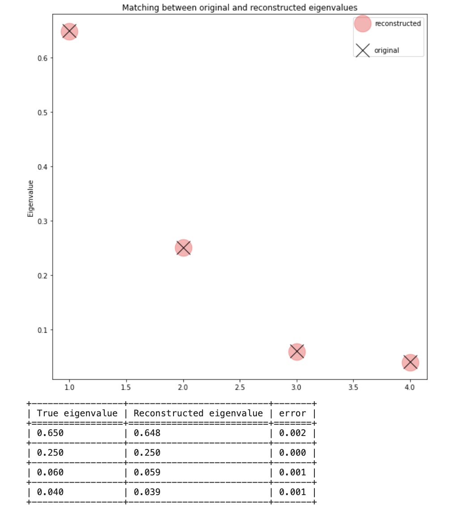

Example
====

In the :mod:`~QPCA.benchmark` module, there are four methods available to benchmark the execution of the Qpca algorithm. 
Below are some examples illustrating the usage of these benchmarking methods.

First, you set a seed to ensure the reproducibility of the experiments. Then, you specify a resolution of 8 qubits and define a custom list of eigenvalues for a 4x4 matrix. 
The number of measurements for the eigenvector reconstruction is set to 1.000.000.

.. code-block:: python

   from QPCA.decomposition.Qpca import QPCA
   import numpy as np
   import matplotlib.pyplot as plt
   from QPCA.preprocessingUtilities.preprocessing import generate_matrix
   from QPCA.benchmark.benchmark import Benchmark_Manager

   seed=4747
   resolutions=[8]
   matrix_dimension=4
   eigenvalues_list=[0.65,0.25,0.06,0.04]
   input_matrix=generate_matrix(matrix_dimension=matrix_dimension,replicate_paper=False,seed=seed,eigenvalues_list=eigenvalues_list)
   shots_numbers=[1000000] 

Next, you create a Qpca object and fit it using the generated input matrix and the chosen resolution. Finally, you utilize the :meth:`~QPCA.decomposition.QPCA.eigenvectors_reconstruction` method to reconstruct the eigenvalues and eigenvectors. 
In the first reference example, you are interested in evaluating the accuracy of reconstructing the eigenvectors using :meth:`~QPCA.decomposition.QPCA.spectral_benchmarking`

.. code-block:: python

   for resolution in resolutions:
      qpca=QPCA().fit(input_matrix,resolution=resolution)
      for s in shots_numbers:
         reconstructed_eigenvalues,reconstructed_eigenvectors=qpca.eigenvectors_reconstruction(n_shots=s,n_repetitions=1)
         results=qpca.spectral_benchmarking(eigenvector_benchmarking=True,sign_benchmarking=False ,eigenvalues_benchmarching=False,print_distances=True,only_first_eigenvectors=False,
                                                        plot_delta=True,distance_type='l2',error_with_sign=True,hide_plot=False,print_error=False)

Eigenvectors benchmark
~~~~~~~~~~~~~~~~~~~~~~

By setting the :obj:`~QPCA.benchmark.eigenvectors_reconstruction.eigenvector_benchmarking` parameter to True, you will obtain a plot similar to the one shown below. 
The plot displays the reconstructed eigenvectors (represented by stars) along with the original eigenvectors (represented by circles). 
The legend includes the l2-error distance between the reconstructed and original eigenvectors.

.. image:: Images/benchmark1.png

Eigenvalues benchmark
~~~~~~~~~~~~~~~~~~~~~~

You can also benchmark the reconstructed eigenvalues by setting the :obj:`~QPCA.benchmark.eigenvectors_reconstruction.eigenvalues_benchmarching` parameter to True. This benchmarking generates a plot that displays the reconstructed eigenvalues as red circles and the original eigenvalues as black crosses. 
If the :obj:`~QPCA.benchmark.eigenvectors_reconstruction.print_error` parameter is set to True, a table is provided, showing the absolute error between the reconstructed and original eigenvalues.

Eigenvectors reconstruction error benchmark
~~~~~~~~~~~~~~~~~~~~~~

The :meth:`~QPCA.benchmark.Benchmark_Manager.error_benchmark` method allows you to visualize the reconstruction error trend for each eigenvector as the number of measurements and resolution qubits increase. 
Similar to before, you need to perform the fit and eigenvector reconstruction procedures after selecting the desired number of measurements and resolution qubits. 
It's important to save the benchmark results in a specific dictionary, as shown in the code below. This is necessary because the :meth:`~QPCA.benchmark.Benchmark_Manager.error_benchmark` function expects dictionaries as parameters.

.. code-block:: python
   
   shots_numbers=[100,500,1500,10000,100000,500000,1000000]
   resolutions=[3,5,8]
   resolution_dictionary={}
   resolution_dictionary_shots={}
   for resolution in resolutions:
      error_list=[]
      delta_list=[]
      shots_dict={}
      qpca=QPCA().fit(input_matrix,resolution=resolution)
      for s in shots_numbers:
         
         reconstructed_eigenvalues,reconstructed_eigenvectors=qpca.eigenvectors_reconstruction(n_shots=s,n_repetitions=1)
         results=qpca.spectral_benchmarking(eigenvector_benchmarking=True,sign_benchmarking=False ,eigenvalues_benchmarching=False,print_distances=True,only_first_eigenvectors=False,
                                                         plot_delta=True,distance_type='l2',error_with_sign=True,hide_plot=False,print_error=False)
         for e in eig_evec_tuple:
               shots_dict.setdefault(e[0], []).append(s)
         error_list.append(eig_evec_tuple)
         delta_list.append(delta)
      
      resolution_dictionary_shots.update({resolution:shots_dict})
      resolution_dictionary.update({resolution:error_list})

   Benchmark_Manager.error_benchmark(input_matrix=input_matrix, shots_dict=resolution_dictionary_shots, error_dict=resolution_dictionary)

.. image:: Images/benchmark3.png

Using these plots, you can observe the trend of the errors for each eigenvector as the number of measurements and resolution qubits increases. 
This allows you to analyze how the errors change with varying experimental parameters and gain insights into the behavior of the reconstruction process.