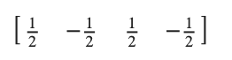
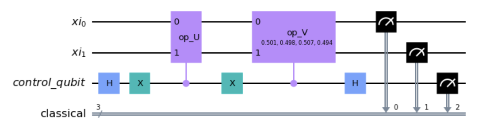

Example
============

In the :mod:`~QPCA.quantumUtilities` module, you can find the implementation of the vector state tomography algorithm, as described in the paper `A Quantum Interior Point Method for LPs and SDPs <https://arxiv.org/abs/1808.09266>`_. 
Below is an example demonstrating a possible general usage of this algorithm.

First, a quantum circuit is generated using the following code. 
This circuit is responsible for encoding the quantum state that you wish to reconstruct.

..  code-block:: python

   from qiskit import QuantumCircuit
   from qiskit import Aer, transpile
   from qiskit.visualization import array_to_latex
   from QPCA.quantumUtilities.Tomography import StateVectorTomography

   qc=QuantumCircuit(2)
   qc.x(0)
   qc.h(0)
   qc.h(1)
   qc.draw()

.. image:: Images/tomography.png

Next, using the statevector simulator provided by the Aer backend, you can extract the true statevector of this circuit. 
This step is solely for the purpose of verifying the results obtained from executing the tomography procedure.

..  code-block:: python

   aer=Aer.get_backend('statevector_simulator')
   statevector=aer.run(transpile(qc,aer)).result().get_statevector()
   array_to_latex(statevector)

Accordingly, you can execute the tomography procedure by providing the quantum circuit as a parameter and specifying the number of shots, which represents the number of times you wish to measure the quantum state. Increasing the number of measurements enhances the accuracy of the estimates. 
The output will be an estimate of the statevector presented as a dictionary, where the keys represent the quantum states and the corresponding values denote the amplitudes with their respective signs.

.. code-block:: python

   >>> StateVectorTomography.state_vector_tomography(qc,n_shots=8000,n_repetitions=1,drawing_amplitude_circuit=True,drawing_sign_circuit=True)

   {'00': 0.5054700782440045,
   '01': -0.4978704650810289,
   '10': 0.5016223679223246,
   '11': -0.4949747468305833}

In the tomography function, you have the option to specify the drawing_amplitude_circuit flag. 
When set to True, the function returns a plot of the circuit that implements the amplitude estimation procedure (step 1 of the algorithm described in `A Quantum Interior Point Method for LPs and SDPs <https://arxiv.org/abs/1808.09266>`_). 

.. image:: Images/amplitude_tomo.png

Furthermore, if you also set the drawing_sign_circuit flag, the function returns a plot of the circuit that implements the sign estimation procedure (step 2 of the algorithm described in `A Quantum Interior Point Method for LPs and SDPs <https://arxiv.org/abs/1808.09266>`_). 

